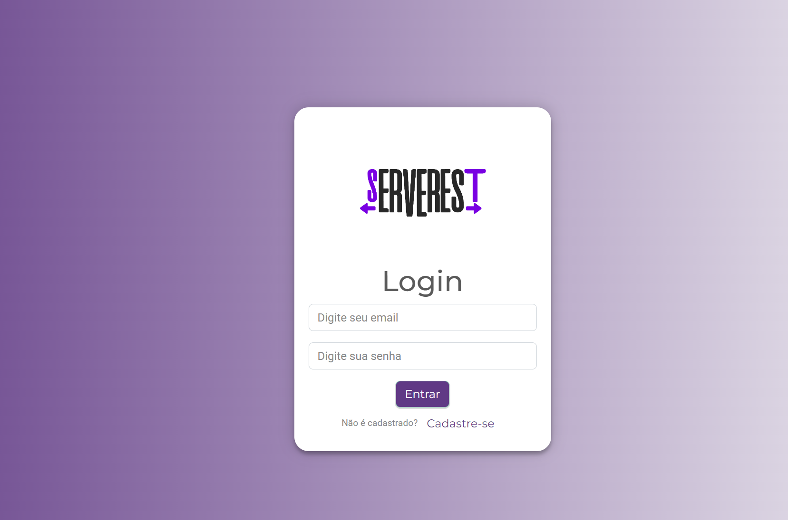
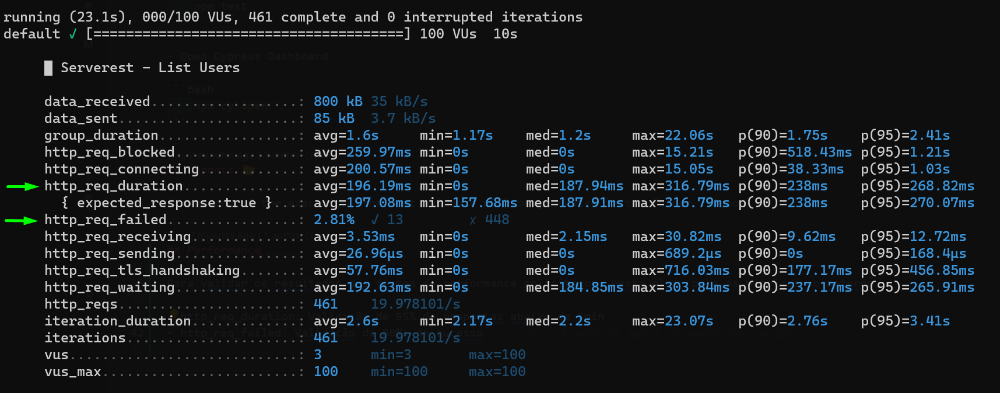

# Automation Challenge by 4intelligence

> Desafio técnico de Automação de Testes com JavaScript, [Cypress](https://www.cypress.io/) and [Cucumber](https://github.com/badeball/cypress-cucumber-preprocessor)



## Setup ⚙️

- Git\
  Instalação Padrão
- NodeJS\
  Instalação Padrão (LTS)
- Dependencies

```bash
    npm install
```

## Como Rodar ⚡

- Todos os testes

```bash
    npm run test
```

- Testes Web

```bash
    npm run test:web
```

- Testes Api

```bash
    npm run test:api
```

- Testes Performance

```bash
    npm run test:k6
```

- Abrir Cypress Dashboard

```bash
    npm run cy:open
```

## Reports 📂

Ao finalizar a execução, as evidências de testes estarão disponíveis na pasta `videos`

## Performance

Para validar os resultados dos testes de performance solicitados, basta olhar para as métricas no retorno:

- http_req_duration: Validação de 95% de respostas abaixo de 5min
- http_req_failed: Validação de 80%+ de sucesso


